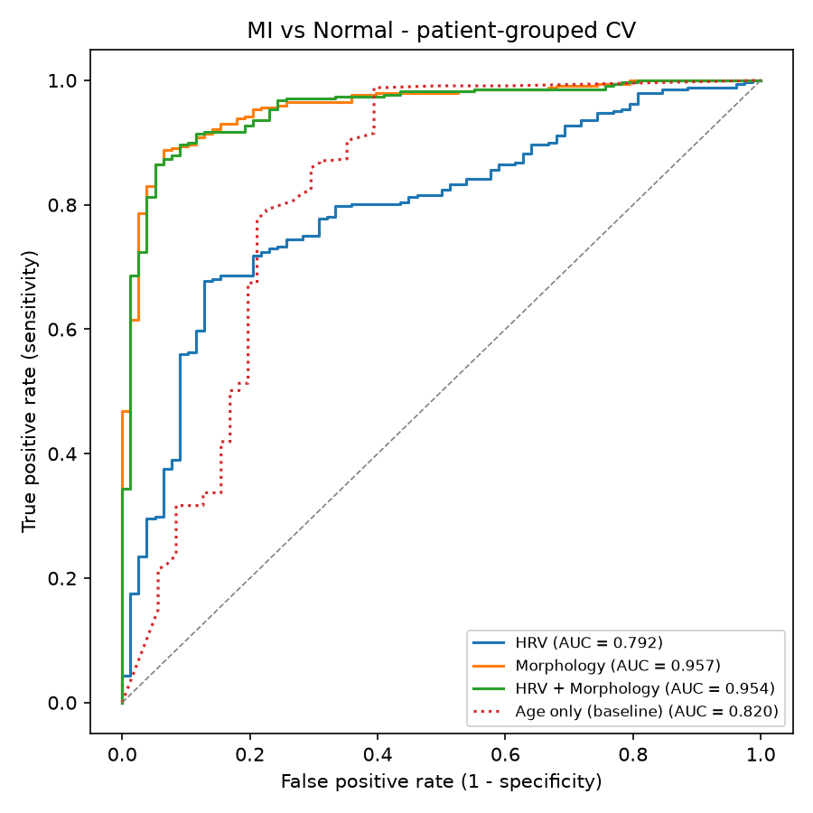
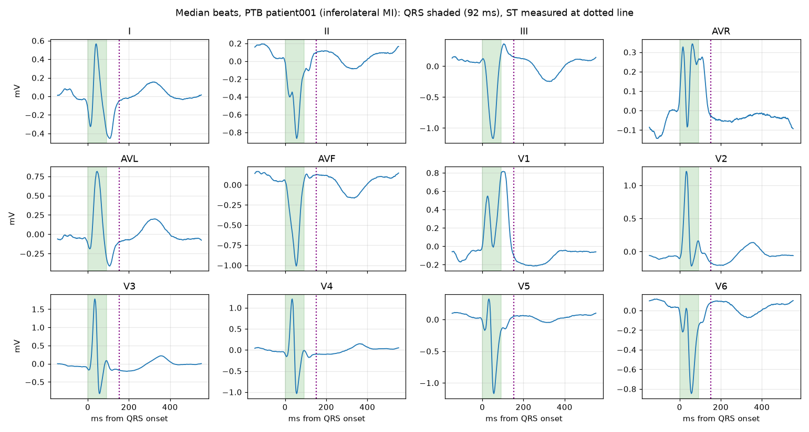
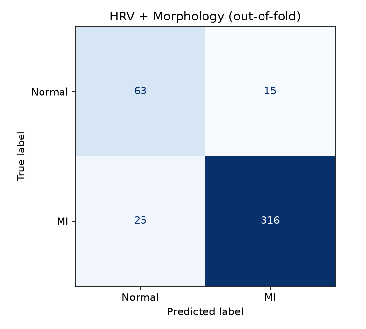
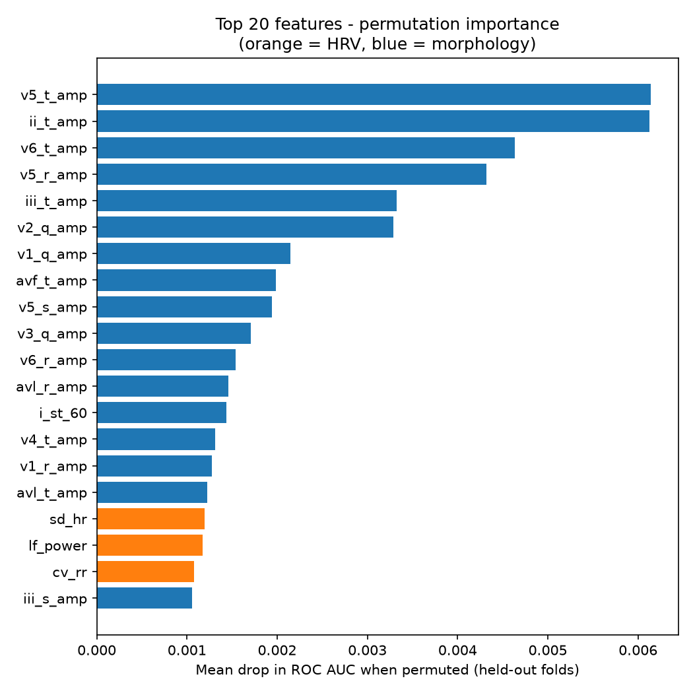

# ECG Analysis Pipeline

An end-to-end biomedical signal processing pipeline that turns raw 12-lead ECG recordings into clinically interpretable features — **heart rate variability (HRV)** and **beat morphology** — and uses them to classify **myocardial infarction (MI) vs. healthy controls**.

Built on the [PTB Diagnostic ECG Database](https://physionet.org/content/ptbdb/1.0.0/) (549 recordings, 290 subjects, 1000 Hz, 15 leads).

📖 New to ECGs or HRV? See **[Clinical and Scientific Background](docs/clinical-background.md)** for the physiology behind every feature.

| | |
|---|---|
| **Best model** | Random Forest on beat-morphology features |
| **ROC AUC** | **0.957** (patient-grouped 5-fold CV) |
| **Sensitivity / Specificity** | 0.93 / 0.85 |
| **Key finding** | Morphology carries the diagnostic signal; HRV alone is no better than an age-only baseline on this dataset |



---

## Pipeline

```
PhysioNet (S3 mirror) ──► load & cache record ──► band-pass filter ──► R-peak detection
                                                        │                     │
                                       0.05–45 Hz (diagnostic)        0.5–45 Hz (detection)
                                                        │                     │
                                                        ▼                     ▼
                                          12-lead median beats      R-R / NN interval series
                                          + QRS delineation                   │
                                                        │                     ▼
                                                        ▼          HRV: time, frequency, non-linear
                                          Morphology: Q/R/S/T amps,           │
                                          ST level, QRS duration              │
                                                        └──────────┬──────────┘
                                                                   ▼
                                                     ptb_features.csv (1 row / recording)
                                                                   │
                                                                   ▼
                                       Random Forest · nested, patient-grouped cross-validation
```

### 1. Signal conditioning — [`src/processing.py`](src/processing.py)
- **Download & cache:** records are fetched from PhysioNet's AWS Open Data mirror (≈8× faster than physionet.org), with physionet.org as a fallback, and cached in `data/raw/ptbdb/`.
- **Filtering:** 4th-order zero-phase Butterworth band-pass, implemented as second-order sections (`sosfiltfilt`) for numerical stability at very low cut-offs. Two bands are used:
  - **0.5–45 Hz** for QRS detection (removes baseline wander and muscle noise);
  - **0.05–45 Hz** for morphology — the diagnostic-grade low cut-off preserves the ST segment, which a 0.5 Hz high-pass would distort.
- **R-peak detection:** Hamilton QRS detector (via `biosppy`) on lead II.

### 2. HRV features — [`src/hrv.py`](src/hrv.py)
R-R intervals are cleaned into an NN series by rejecting physiologically implausible intervals (outside 300–2000 ms) and likely ectopic/missed beats (>20 % from the median).

| Domain | Features |
|---|---|
| Time | `mean_rr`, `sdnn`, `rmssd`, `pnn50`, `mean_hr`, `sd_hr`, `cv_rr` |
| Frequency | `lf_power`, `hf_power`, `lf_hf_ratio`, `lf_nu`, `hf_nu` — NN tachogram resampled at 4 Hz (cubic spline), detrended, Welch PSD; LF 0.04–0.15 Hz, HF 0.15–0.40 Hz |
| Non-linear | Poincaré `sd1`, `sd2`, `sd1_sd2_ratio`; `sample_entropy` (m = 2, r = 0.2·SD) |

### 3. Morphology features — [`src/morphology.py`](src/morphology.py)
- A **median beat** is built per lead (robust to ectopic beats and noise bursts).
- **Global QRS onset/offset** are found from the summed absolute slope of all 12 leads, anchored on its maximum and grown outwards while bridging short notches — mirroring how QRS duration is measured clinically across leads.
- Per lead (×12), relative to the isoelectric PR segment: `r_amp`, `q_amp`, `s_amp`, `st_j` (J-point), `st_60` (J + 60 ms), `t_amp`. Plus global `qrs_duration` and `template_corr` (beat-to-template correlation, used as a quality index).



*Median beats for an inferolateral MI patient: note the inverted T waves in the inferior leads (II, III, aVF).*

### 4. Dataset — [`src/build_dataset.py`](src/build_dataset.py)
Processes all 549 recordings in parallel and writes `data/processed/ptb_features.csv` — one row per recording with ~90 features plus metadata (`record`, `patient`, `diagnosis`, `age`, `sex`) and quality indicators (`n_beats`, `nn_fraction`, `template_corr`). Labels are `MI` (368 recordings / 148 patients), `Normal` (80 / 52) and `Other` (101 recordings with other diagnoses, kept for future multi-class work).

### 5. Model — [`src/train_model.py`](src/train_model.py)
- **Task:** MI vs. Normal (448 recordings, 200 patients); 29 low-quality recordings removed (`nn_fraction < 0.8` or `template_corr < 0.8`).
- **Patient-grouped evaluation:** `StratifiedGroupKFold` ensures every recording of a patient is in the same fold, so the model is always scored on unseen people. (A record-level split would leak patient identity and inflate scores.)
- **Nested CV:** hyperparameters (`max_depth`, `min_samples_leaf`, `max_features`) are tuned with an inner grouped CV inside each training fold only.
- **Class imbalance:** `class_weight='balanced'` (MI outnumbers Normal ~4:1).
- **Feature importance:** permutation importance on held-out folds (less biased than impurity importance).

---

## Results

All metrics are out-of-fold, patient-grouped 5-fold CV, threshold 0.5.

| Feature set | ROC AUC | Balanced acc. | Sensitivity | Specificity |
|---|---|---|---|---|
| HRV (16) | 0.792 | 0.723 | 0.780 | 0.667 |
| **Morphology (73)** | **0.957** | **0.888** | **0.930** | **0.846** |
| HRV + Morphology (89) | 0.954 | 0.867 | 0.927 | 0.808 |
| Age only (baseline) | 0.820 | 0.768 | 0.818 | 0.718 |
| HRV + Morphology, age ≥ 40 only | 0.913 | 0.784 | 0.926 | 0.643 |

<p>
  
  
</p>

### Interpretation
- **Morphology is where the signal is.** The most important features are T-wave amplitudes (V5, II, V6, III, aVF), Q-wave depth in V1–V3 and R-wave amplitude in V5 — the textbook ECG signs of infarction (T-wave inversion, pathological Q waves, R-wave loss). The model learned physiology, not artefacts.
- **HRV is confounded by age.** Reduced HRV after MI is well documented, and the data agree (median SDNN 21.7 ms in MI vs. 39.1 ms in controls). But PTB's healthy controls are ~23 years younger than the MI patients (median 37 vs. 60), and HRV declines with age — an age-only model (AUC 0.82) outperforms HRV alone (0.79), and adding HRV to morphology does not help.
- **Robustness check:** restricting evaluation to patients aged ≥ 40, where the cohorts overlap, AUC stays at 0.91, but specificity drops to 0.64 (only 28 Normal recordings in that subset, so this estimate is noisy).

## Limitations
- **Small, imbalanced cohort:** 52 healthy subjects. Specificity estimates have wide uncertainty; results should be validated on an external dataset (e.g. PTB-XL).
- **Short recordings:** most PTB records are ~115 s. This is adequate for time-domain HRV and HF power, but LF power formally requires ≥ 2 min (computed here from 90 s as a short-term estimate) and is missing for ~16 % of recordings.
- **Resting, in-hospital ECGs:** HRV under these conditions captures little autonomic dynamics; 24-h Holter data would be a better test of HRV's value.
- **Recording-level metrics:** patients with several recordings contribute more than one prediction.

## Getting started

```bash
pip install -r requirements.txt

# 1. Build the feature dataset (downloads ~1.7 GB on first run, ~7 min)
python3 src/build_dataset.py --workers 8

# 2. Train and evaluate (writes reports/ and models/rf_combined.joblib, ~3 min)
python3 src/train_model.py

# Single-record walkthrough (prints all features for one recording)
python3 src/main.py
```

`build_dataset.py --limit 10` processes a small subset for quick testing; `train_model.py --no-tune` skips the nested hyperparameter search. The notebook [`notebooks/00-data-exploration.ipynb`](notebooks/00-data-exploration.ipynb) visualises each processing step.

## Project structure

```
├── src/
│   ├── processing.py      # loading/caching, filtering, R-peak detection
│   ├── hrv.py             # time, frequency and non-linear HRV
│   ├── morphology.py      # median beats, QRS delineation, per-lead amplitudes
│   ├── build_dataset.py   # batch feature extraction → data/processed/ptb_features.csv
│   ├── train_model.py     # nested patient-grouped CV, reports, final model
│   └── main.py            # single-record demo
├── docs/                  # clinical and scientific background
├── notebooks/             # exploratory visualisation
├── reports/               # metrics and figures
└── data/                  # raw cache (gitignored) and processed features
```

## Future work
- Validate on PTB-XL (21,000+ recordings) for an external test set.
- Multi-class classification using the `Other` diagnoses (bundle branch block, cardiomyopathy, …).
- MI localisation (anterior vs. inferior) from lead-specific morphology.
- Age-matched sampling or age-adjusted HRV to separate disease effects from ageing.

## References
- Bousseljot R, Kreiseler D, Schnabel A. *Nutzung der EKG-Signaldatenbank CARDIODAT der PTB über das Internet.* Biomedizinische Technik 40(S1):317, 1995.
- Goldberger AL, et al. *PhysioBank, PhysioToolkit, and PhysioNet.* Circulation 101(23):e215–e220, 2000.
- Task Force of the ESC and NASPE. *Heart rate variability: standards of measurement, physiological interpretation and clinical use.* Circulation 93(5):1043–1065, 1996.
- Richman JS, Moorman JR. *Physiological time-series analysis using approximate entropy and sample entropy.* Am J Physiol Heart Circ Physiol 278(6):H2039–H2049, 2000.

## License
MIT — see [LICENSE](LICENSE).
